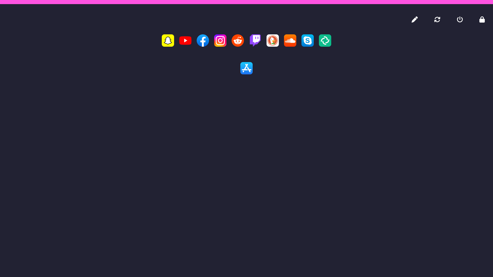

# koyuOS v2

koyuOS v2 is a new take on grapical user interfaces by being very web-centric and running fullscreen apps only.

## Running koyuOS

* Download the official image for Raspberry Pi 3/4/5: https://drive.google.com/file/d/1hWzIk-uTSzzPVvlgrwEHr-yFfw-BhLAW/view?usp=sharing
* Flash the .img.gz file to your SD card using the Raspberry Pi Imager
* Insert the SD card in the Raspberry Pi and give it power
* Wait a few seconds until the filesystem has been resized, the Pi will now reboot
* Then wait a few minutes until the system finished all updates and compiled the user interface

# Screenshot

